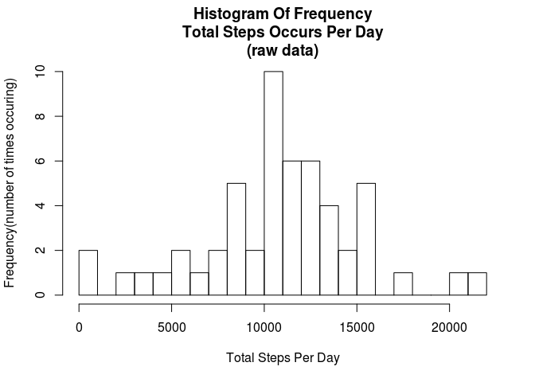

# Reproducible Research: Peer Assessment 1


## Loading and preprocessing the data

```r
# File names (as constants)
chrFile_input <- "activity.zip"
chrFile_read <- "activity.csv"
# First unzip the data, it's already in the GIT repository conatining this document
unzip (chrFile_input)
dfStep_data <- read.csv(chrFile_read)
```
## What is mean total number of steps taken per day?

```r
# Calculate the total number of steps per day
numSteps_day = tapply(dfStep_data$steps,dfStep_data$date,FUN=sum,na.rm=TRUE)
# Generate the new mean & median  steps per day
numSteps_mean <- as.integer(mean(numSteps_day, na.rm=TRUE))
numSteps_median <- as.integer(median(numSteps_day, na.rm=TRUE))
# Then plot a histogram
hist(numSteps_day,20,
     main="Histogram Of Frequency\nTotal Steps Occurs Per Day\n(raw data)",
     xlab="Total Steps Per Day",ylab="Frequency(number of times occuring)")
```


  
The mean of the total number of steps per day is 9354
 and the median of the total number of steps per day is 10395  

## What is the average daily activity pattern?


```r
# Generate base data
numAve_steps_interval <- tapply(dfStep_data$steps,dfStep_data$interval,FUN=mean,na.rm=TRUE)
# Which 5 minute time-period averages max steps
numIndex <- which.max(numAve_steps_interval) # Find index to Max steps
chrIntervals <- levels (as.factor(dfStep_data$interval))
numMax_steps <- as.integer(max(numAve_steps_interval))
numMax_occurs_at <- chrIntervals[numIndex]
# Plot the data
plot(levels (as.factor(dfStep_data$interval)), numAve_steps_interval, ,type="l",
     main="Average Steps By 5 Minute Interval",
     xlab="5 Minute Interval", ylab="Average Steps")
```


  
As can bee seen in the chart above, a big activity peak occurs in the morning  

The maximum number of steps (on average) is 206
 and occurs in the 5 minute interval starting at 835

## Imputing missing values


```r
# Calculate total number of NAs
numNas <- sum(is.na(dfStep_data$steps))

# Impute missing data - use overall average for that 5 minute interval (rounded to integer)
dfStep_data_imp <- dfStep_data
for (i in 1:length(numAve_steps_interval)){
    dfStep_data_imp$steps[dfStep_data_imp$interval==chrIntervals[i] & 
                              is.na(dfStep_data_imp$steps)] <- round(numAve_steps_interval[i],0)
}

# Generate the new mean & median  steps per day
numSteps_day_imp = tapply(dfStep_data_imp$steps,dfStep_data_imp$date,FUN=sum,na.rm=TRUE)
numSteps_mean_imp <- as.integer(mean(numSteps_day_imp, na.rm=TRUE))
numSteps_median_imp <- as.integer(median(numSteps_day_imp, na.rm=TRUE))

# Create a new Hist
hist(numSteps_day_imp,20,
     main="Histogram Of Frequency\nTotal Steps Occurs Per Day\n(with imputed data)",
     xlab="Total Steps Per Day",ylab="Frequency(number of times occuring)")
```


  
There were 2304 NAs in the raw data.  
  
Once NAs are replaced with imputed data (ie. with the average for that 5 minute time period)  
1.  The new mean steps per day is 10765 (vs 9354 previously)  
2.  The new median steps per day is 10762  (vs 10395 previously)  
  
We can see that the mean and median number of steps per day have risen once data is "imputed".
 This reflects the fact that we have added data where previously there was none.   
  
It should be noted that many NAs occurred where there was no data for a whole day - 
 these imputed values would have little impact on the overall median.  
  
NOTE: Imputed data is  
1. Based on the 5 minute intervals  
2. Imputed values are for intervals where the "number of steps" value is NA  
3. Values assigned are the rounded integer value of the average number of steps for that 5 minute interval  

## Are there differences in activity patterns between weekdays and weekends?


```r
# Compare weekday activity to weekends
# Start by categorising days as either weekday or weekend
library(lubridate, warn.conflicts=FALSE)  # Date handling, myd function
dfStep_data_imp$day_type <- rep("WorkDay",length(dfStep_data_imp$date))
dfStep_data_imp$day_type[weekdays(ymd(as.character(dfStep_data_imp$date))) %in% c("Saturday","Sunday")] <- "Weekend"
dfStep_data_imp$day_type <- as.factor(dfStep_data_imp$day_type)
# Create the data to be used for plots, a summary of steps by day-type and 5-minute-interval
library("data.table", warn.conflicts=FALSE)    # Data table handling, for Aggregate function
numAve_steps_interval_imp <- tapply(dfStep_data_imp$steps,dfStep_data_imp$interval,FUN=mean,na.rm=TRUE)
dfPlot_final <- aggregate.data.frame(dfStep_data_imp$steps,  
                                     list(dfStep_data_imp$interval, dfStep_data_imp$day_type), FUN=mean)
names(dfPlot_final) <- c("interval","day_type","AveSteps")
# Create the plot (2 plots side by side)
par(mar=c(2,2,5,1),mfcol=c(1,2),cex.main=0.6,cex.lab=0.6,cex.axis=0.6)
numYrange <-range(0,dfPlot_final$AveSteps) # Set max Y value - for easier comparison
plot(levels(as.factor(dfPlot_final$interval)), dfPlot_final$AveSteps[dfPlot_final$day_type=="WorkDay"],
     ylim=numYrange, main="Week Day Average Steps By 5 Minute Interval",
     xlab="5 Minute Interval", ylab="Average Steps", type="l")
plot(levels(as.factor(dfPlot_final$interval)), dfPlot_final$AveSteps[dfPlot_final$day_type=="Weekend"],
     ylim=numYrange, main="Weekend Average Steps By 5 Minute Interval",
     xlab="5 Minute Interval", ylab="Average Steps", type="l")
```


  
as can be seen from the graphs above -  
1) There's a major activity peak on weekday mornings which is delayed and moderated on a weekend  
2) Weekend activity starts later, is more evenly distributed through the day and continues a little longer into the evening  
